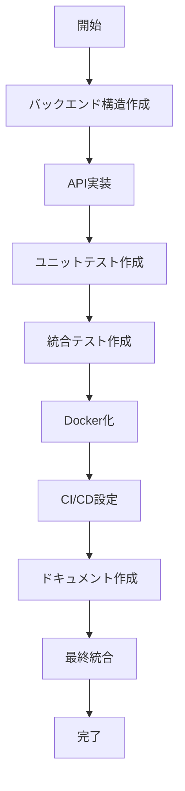

# Claude Conductor - Collaborative Development Demo

This demo demonstrates how multiple agents collaborate to develop a web application using Claude Conductor.

このデモは、Claude Conductorを使用して複数のエージェントが協調してWebアプリケーションを開発する様子を実演します。

## 🎯 Demo Overview

Four specialized agents divide tasks according to their roles and develop a complete Todo management API application.

4つの専門化されたエージェントが、それぞれの役割に応じてタスクを分担し、完全なTodo管理APIアプリケーションを開発します。

### Agent Roles

1. **Backend Developer (Agent 1)**
   - Building Flask applications
   - Implementing database models
   - Creating REST API endpoints

2. **Test Engineer (Agent 2)**
   - Creating unit tests
   - Implementing integration tests
   - Setting up test coverage

3. **DevOps Engineer (Agent 3)**
   - Creating Dockerfiles
   - Configuring Docker Compose
   - Building CI/CD pipelines

4. **Documentation Specialist (Agent 4)**
   - Generating API documentation
   - Creating user guides
   - Creating OpenAPI specifications

### エージェントの役割

1. **Backend Developer (Agent 1)**
   - Flask アプリケーションの構築
   - データベースモデルの実装
   - REST API エンドポイントの作成

2. **Test Engineer (Agent 2)**
   - ユニットテストの作成
   - 統合テストの実装
   - テストカバレッジの設定

3. **DevOps Engineer (Agent 3)**
   - Dockerfile の作成
   - Docker Compose 設定
   - CI/CD パイプラインの構築

4. **Documentation Specialist (Agent 4)**
   - API ドキュメントの生成
   - ユーザーガイドの作成
   - OpenAPI 仕様書の作成

## 🚀 デモの実行方法

### 前提条件

- Python 3.10以上
- Podman または Docker
- 4GB以上の空きメモリ

### 実行手順

1. **デモディレクトリに移動**
   ```bash
   cd demo
   ```

2. **デモを実行**
   ```bash
   ./run-demo.sh
   ```

3. **実行結果を確認**
   デモが完了すると、`sample-project` ディレクトリに完全なWebアプリケーションが作成されます。

## 📁 作成されるプロジェクト構造

```
sample-project/
├── src/
│   ├── app.py              # Flask アプリケーション
│   ├── api/
│   │   ├── __init__.py
│   │   └── routes.py       # API エンドポイント
│   ├── models/
│   │   ├── __init__.py
│   │   ├── database.py     # データベース設定
│   │   └── todo.py         # Todo モデル
│   └── utils/
│       └── __init__.py
├── tests/
│   ├── conftest.py         # テスト設定
│   ├── unit/
│   │   └── test_models.py  # モデルのユニットテスト
│   └── integration/
│       └── test_api.py     # API の統合テスト
├── docs/
│   ├── api/
│   │   ├── README.md       # API ドキュメント
│   │   └── openapi.yaml    # OpenAPI 仕様
│   └── guides/
│       └── getting-started.md
├── requirements.txt        # Python 依存関係
├── Dockerfile             # Docker イメージ定義
├── docker-compose.yml     # Docker Compose 設定
├── Makefile              # ビルドコマンド
├── deploy.sh             # デプロイスクリプト
├── nginx.conf            # Nginx 設定
└── .github/
    └── workflows/
        └── ci.yml        # GitHub Actions CI/CD

```

## 🔄 タスクの実行フロー



## 🧪 作成されたアプリケーションのテスト

### ローカル実行

```bash
cd sample-project
python3 -m venv venv
source venv/bin/activate  # Windows: venv\Scripts\activate
pip install -r requirements.txt
python src/app.py
```

### Docker実行

```bash
cd sample-project
docker-compose up -d
```

### API テスト

```bash
# Todo 作成
curl -X POST http://localhost:5000/api/todos \
  -H "Content-Type: application/json" \
  -d '{"title": "デモタスク", "description": "Claude Conductorで作成"}'

# Todo 一覧取得
curl http://localhost:5000/api/todos

# Todo 更新
curl -X PUT http://localhost:5000/api/todos/1 \
  -H "Content-Type: application/json" \
  -d '{"completed": true}'

# Todo 削除
curl -X DELETE http://localhost:5000/api/todos/1
```

## 🎨 デモのカスタマイズ

### エージェント数の変更

`config/demo-config.yaml` を編集：

```yaml
orchestrator:
  num_agents: 6  # 4から6に変更
```

### 新しい開発環境の追加

```yaml
environments:
  - name: "frontend-dev"
    image: "node:18"
    packages:
      - "react"
      - "typescript"
      - "webpack"
```

### タスクの追加

`collaborative-dev/multi_agent_demo.py` の `create_development_tasks` メソッドに新しいタスクを追加。

## 📊 パフォーマンス

典型的な実行時間:
- タスク数: 8-10
- 総実行時間: 2-5分
- 並列実行: 最大4タスク

## 🐛 トラブルシューティング

### エラー: "Conductor module not found"
```bash
export PYTHONPATH=/path/to/claude-conductor:$PYTHONPATH
```

### エラー: "Podman not found"
PodmanまたはDockerをインストールしてください。

### タスクの失敗
ログを確認：
```bash
cat demo/logs/*.log
```

## 📝 学習ポイント

このデモから学べること：

1. **マルチエージェントアーキテクチャ**
   - エージェントの専門化と役割分担
   - 並列タスク実行の利点

2. **タスク依存関係の管理**
   - 依存関係グラフの構築
   - 優先度ベースのスケジューリング

3. **隔離されたワークスペース**
   - 各エージェントの独立した実行環境
   - Podmanによるコンテナ化

4. **実践的な開発フロー**
   - TDD（テスト駆動開発）
   - CI/CDパイプライン
   - ドキュメント作成

## 🚀 次のステップ

1. **カスタムタスクの追加**
   - フロントエンド開発タスク
   - セキュリティスキャンタスク
   - パフォーマンステスト

2. **実プロジェクトへの適用**
   - 既存プロジェクトの自動化
   - チーム開発への導入

3. **スケールアップ**
   - Kubernetes環境での実行
   - 大規模プロジェクトへの適用

---

詳細については、[Claude Conductor ドキュメント](../README.md)を参照してください。