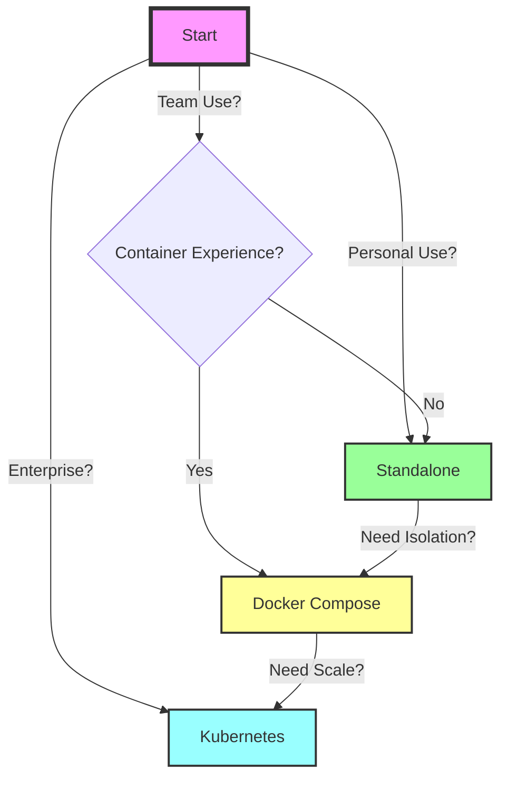

# Claude Conductor - Architecture Comparison

## 📊 Feature Comparison Matrix

| Feature Category | Standalone | Docker Compose | Kubernetes (Full) |
|-----------------|------------|----------------|-------------------|
| **Deployment** |
| Setup Time | 5 minutes | 10 minutes | 30+ minutes |
| Setup Complexity | ⭐ | ⭐⭐ | ⭐⭐⭐⭐⭐ |
| Required Skills | Basic CLI | Docker basics | K8s expertise |
| **Scale** |
| Agent Count | 1-4 | 1-10 | 1-1000+ |
| Node Count | 1 | 1 | Unlimited |
| Auto-scaling | ❌ | ❌ | ✅ |
| **Resources** |
| Min RAM | 2GB | 4GB | 16GB+ |
| Min CPU | 1 core | 2 cores | 4+ cores |
| Storage Type | Local files | Docker volumes | PVC/Cloud storage |
| **Features** |
| Web Dashboard | ✅ | ✅ | ✅ |
| API Access | ✅ | ✅ | ✅ |
| Task Queue | In-memory | Redis (optional) | Redis cluster |
| Monitoring | Basic logs | Container logs | Full observability |
| **Reliability** |
| High Availability | ❌ | ❌ | ✅ |
| Auto-recovery | Basic | Container restart | Full orchestration |
| Backup/Restore | Manual | Volume backup | Automated |
| **Security** |
| Authentication | ❌ | Basic | Enterprise |
| Encryption | ❌ | Optional | mTLS everywhere |
| Network Isolation | Host only | Docker network | Network policies |

## 🏗️ Architecture Patterns

### 1. Standalone Pattern (開発・学習用)

```
┌─────────────────────────────────────┐
│         Single Machine              │
│  ┌─────────────────────────────┐   │
│  │   Python Virtual Env        │   │
│  │  ┌──────┐ ┌──────────┐    │   │
│  │  │ CLI  │ │Dashboard │    │   │
│  │  └──┬───┘ └────┬─────┘    │   │
│  │     │          │           │   │
│  │  ┌──▼──────────▼─────┐    │   │
│  │  │   Orchestrator     │    │   │
│  │  └──────┬───────────┘    │   │
│  │         │                 │   │
│  │  ┌──────▼────────┐       │   │
│  │  │ Local Agents  │       │   │
│  │  │   (1-4)       │       │   │
│  │  └───────────────┘       │   │
│  └─────────────────────────────┘   │
│                                     │
│  📁 ~/.claude-conductor/            │
└─────────────────────────────────────┘
```

**Use Cases:**
- 個人開発者の自動化ツール
- Claude Conductorの学習・評価
- 小規模なバッチ処理
- プロトタイピング

### 2. Container Pattern (小規模運用)

```
┌─────────────────────────────────────┐
│         Docker Host                 │
│  ┌─────────────────────────────┐   │
│  │   Docker Compose Stack      │   │
│  │  ┌──────────────────────┐  │   │
│  │  │ conductor:latest     │  │   │
│  │  │ ┌────┐ ┌─────────┐ │  │   │
│  │  │ │Orch│ │Dashboard│ │  │   │
│  │  │ └────┘ └─────────┘ │  │   │
│  │  └──────────────────────┘  │   │
│  │  ┌──────────────────────┐  │   │
│  │  │ redis:alpine (opt)  │  │   │
│  │  └──────────────────────┘  │   │
│  │  ┌──────────────────────┐  │   │
│  │  │ nginx:alpine (opt)  │  │   │
│  │  └──────────────────────┘  │   │
│  └─────────────────────────────┘   │
│                                     │
│  🔗 Volumes → Host filesystem      │
└─────────────────────────────────────┘
```

**Use Cases:**
- チーム開発環境
- 小規模な本番運用
- CI/CDパイプライン統合
- 隔離された実行環境が必要な場合

### 3. Kubernetes Pattern (エンタープライズ)

```
┌──────────────────────────────────────────┐
│           Kubernetes Cluster             │
│  ┌────────────────────────────────────┐ │
│  │         Ingress Controller         │ │
│  └────────────┬───────────────────────┘ │
│               │                          │
│  ┌────────────▼───────────────────────┐ │
│  │      Application Namespace         │ │
│  │  ┌─────────┐ ┌─────────┐ ┌──────┐│ │
│  │  │Dashboard│ │   API   │ │ Orch ││ │
│  │  │   Pod   │ │   Pod   │ │ Pod  ││ │
│  │  └─────────┘ └─────────┘ └──────┘│ │
│  │  ┌─────────────────────────────┐  │ │
│  │  │    Agent ReplicaSet         │  │ │
│  │  │  ┌───┐ ┌───┐ ┌───┐ ┌───┐ │  │ │
│  │  │  │A1 │ │A2 │ │A3 │ │... │ │  │ │
│  │  │  └───┘ └───┘ └───┘ └───┘ │  │ │
│  │  └─────────────────────────────┘  │ │
│  └────────────────────────────────────┘ │
│  ┌────────────────────────────────────┐ │
│  │         Data Services              │ │
│  │  ┌──────┐ ┌──────┐ ┌───────────┐ │ │
│  │  │Redis │ │ PG   │ │   S3      │ │ │
│  │  └──────┘ └──────┘ └───────────┘ │ │
│  └────────────────────────────────────┘ │
│  ┌────────────────────────────────────┐ │
│  │      Monitoring Stack              │ │
│  │  ┌────────┐ ┌───────┐ ┌────────┐ │ │
│  │  │Promeths│ │Grafana│ │ Loki   │ │ │
│  │  └────────┘ └───────┘ └────────┘ │ │
│  └────────────────────────────────────┘ │
└──────────────────────────────────────────┘
```

**Use Cases:**
- 大規模エンタープライズ環境
- マルチテナント対応
- 24/7高可用性が必要
- コンプライアンス要件
- グローバル分散デプロイ

## 🔄 Migration Strategies

### Phase 1: Standalone → Docker
```bash
# Export current configuration
conductor config export > config.backup.yaml

# Stop standalone
conductor stop

# Start with Docker Compose
docker-compose -f docker-compose.standalone.yml up -d

# Import configuration
docker exec claude-conductor conductor config import < config.backup.yaml
```

### Phase 2: Docker → Kubernetes
```bash
# Build and push images
docker build -t myregistry/claude-conductor:v1.0 .
docker push myregistry/claude-conductor:v1.0

# Update Kubernetes manifests
sed -i 's|claudeconductor/claude-conductor:latest|myregistry/claude-conductor:v1.0|g' k8s/*.yaml

# Deploy to Kubernetes
kubectl create namespace claude-conductor
kubectl apply -k k8s/
```

## 🎯 Decision Tree



## 📈 Performance Characteristics

### Standalone Performance
- **Startup Time**: < 5 seconds
- **Task Latency**: ~100ms
- **Memory Usage**: 200-500MB
- **CPU Usage**: 5-20%

### Docker Performance
- **Startup Time**: 10-30 seconds
- **Task Latency**: ~150ms
- **Memory Usage**: 500MB-2GB
- **CPU Usage**: 10-30%

### Kubernetes Performance
- **Startup Time**: 1-5 minutes
- **Task Latency**: ~200ms (with optimization: ~50ms)
- **Memory Usage**: 2-10GB (cluster total)
- **CPU Usage**: Variable with HPA

## 🔧 Optimization Tips

### For Standalone
1. Reduce agent count for low-spec machines
2. Use local SSD for workspace
3. Disable unnecessary features
4. Tune Python garbage collection

### For Docker
1. Use multi-stage builds
2. Enable BuildKit caching
3. Mount volumes for persistence
4. Use resource limits

### For Kubernetes
1. Use node affinity for agents
2. Enable pod disruption budgets
3. Implement proper health checks
4. Use horizontal pod autoscaling
5. Configure resource requests/limits
6. Use persistent volume claims
7. Implement service mesh for security

## 🚀 Quick Decision Guide

Choose **Standalone** if:
- ✅ Single user
- ✅ Limited resources
- ✅ Quick evaluation needed
- ✅ No container experience

Choose **Docker Compose** if:
- ✅ Small team (< 10 users)
- ✅ Need environment isolation
- ✅ Want easy deployment
- ✅ Have Docker experience

Choose **Kubernetes** if:
- ✅ Large organization
- ✅ Need high availability
- ✅ Require auto-scaling
- ✅ Have K8s expertise
- ✅ Need enterprise features

## 🔒 Agent Workspace Isolation

### Isolation Levels by Deployment Mode

#### 1. Standalone Mode (基本的な隔離)
- **隔離レベル**: ⭐⭐
- **実装方法**:
  - **ファイルシステム**: 各エージェントは `/tmp/claude_workspace_{agent_id}` に専用ディレクトリ
  - **プロセス分離**: 別プロセスとして実行、独自のメモリ空間
  - **リソース制限**: 設定可能なメモリ・CPU制限（デフォルト: メモリ1GB、CPU 0.5コア）
  - **ローカルストレージ**: `~/.claude-conductor/workspace/{agent_id}/` でエージェント別サブディレクトリ

#### 2. Docker Compose Mode (コンテナベースの隔離)
- **隔離レベル**: ⭐⭐⭐⭐
- **実装方法**:
  - **コンテナ分離**: 各エージェントが独立したDockerコンテナで実行
  - **ボリュームマウント**: 特定ディレクトリのみバインドマウント
    ```yaml
    volumes:
      - conductor_workspace:/workspace
      - conductor_logs:/var/log/conductor
    ```
  - **ネットワーク分離**: 専用Dockerネットワーク (`claude-network`) 経由でのみ通信
  - **リソース制限**: Dockerレベルでの制限
    ```yaml
    deploy:
      resources:
        limits:
          cpus: '2.0'
          memory: 2G
    ```
  - **セキュリティコンテキスト**: 非rootユーザー (UID 1000) での実行

#### 3. Kubernetes Mode (エンタープライズグレードの隔離)
- **隔離レベル**: ⭐⭐⭐⭐⭐
- **実装方法**:
  - **Pod分離**: 各エージェントが独立したPodで実行
  - **Namespace分離**: 専用の `claude-conductor` namespace
  - **セキュリティコンテキスト**:
    ```yaml
    securityContext:
      runAsNonRoot: true
      runAsUser: 1000
      runAsGroup: 1000
      fsGroup: 1000
      allowPrivilegeEscalation: false
      capabilities:
        drop:
        - ALL
    ```
  - **ボリューム隔離**:
    - 共有ワークスペース: `PersistentVolumeClaim` (`ReadWriteMany`)
    - エージェント専用: `emptyDir` ボリューム (5Gi制限)
  - **RBAC**: ServiceAccountとRoleによる細かい権限制御
  - **Network Policies**: Pod間通信の制限設定可能

### Podman実装の詳細

すべての構成で使用されるPodmanコンテナの隔離機能:

```python
cmd = [
    "podman", "run", "-d",
    "--name", container_name,
    "-v", f"{work_dir}:/workspace:Z",  # SELinuxコンテキスト
    "-w", "/workspace",
    "--memory", "2g",                   # メモリ隔離
    "--cpus", "1.0",                   # CPU隔離
    "--userns=keep-id",                # ユーザー名前空間隔離
    podman_image,
    "sleep", "infinity"
]
```

主要な隔離メカニズム:
- **ユーザー名前空間**: `--userns=keep-id` でUID/GIDマッピング
- **SELinuxコンテキスト**: `:Z` フラグで適切なラベリング
- **リソース制限**: メモリ (2GB) とCPU (1.0コア) の制約
- **ファイルシステム隔離**: 各コンテナ独自のファイルシステムレイヤー

### ワークスペース隔離の設定オプション

#### Standalone設定 (`config/standalone.yaml`):
```yaml
container_config:
  memory_limit: "1g"
  cpu_limit: "0.5"
  enable_networking: false  # ネットワーク隔離
  workspace_mount: true

storage:
  workspace_path: "~/.claude-conductor/workspace"
  temp_path: "/tmp/claude-conductor"
  agent_isolation: true  # エージェント間の隔離を有効化
```

#### Production設定 (`config/config.yaml`):
```yaml
agent:
  container_memory: "2g"
  container_cpu: "1.0"
  workspace_isolation: strict  # strict/moderate/minimal
  health_check_interval: 30
  startup_timeout: 60
```

### セキュリティ境界

| セキュリティ層 | Standalone | Docker | Kubernetes |
|---------------|-----------|---------|------------|
| プロセス分離 | ✅ 基本 | ✅ コンテナ | ✅ Pod |
| ファイルシステム | ⚠️ 同一ホスト | ✅ レイヤー分離 | ✅ 完全分離 |
| ネットワーク | ❌ 共有 | ✅ Bridge分離 | ✅ CNI + Policy |
| リソース制限 | ⚠️ ソフト制限 | ✅ cgroup | ✅ cgroup + quota |
| 権限管理 | ⚠️ OS依存 | ✅ 非root | ✅ RBAC + PSP |
| 通信制御 | ⚠️ プロセス間 | ✅ Docker API | ✅ Service Mesh |

### エージェント間通信

すべての構成で、エージェント間の直接通信は禁止されており、必ずOrchestratorを介して行われます：

1. **メッセージブローカー**: Orchestratorが中央のメッセージブローカーとして機能
2. **Unix Socket**: エージェントとOrchestratorの通信はUnix Socket経由
3. **タスクキュー**: Redis（オプション）またはインメモリキューでタスク管理
4. **認証**: 各エージェントには一意のIDとトークンが発行される

この設計により、エージェントが互いに干渉することなく、安全に並列実行できます。