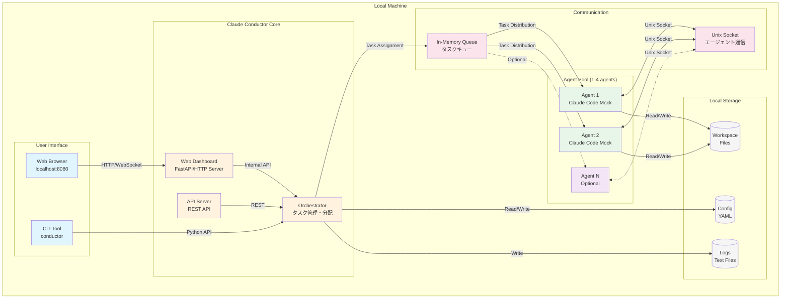
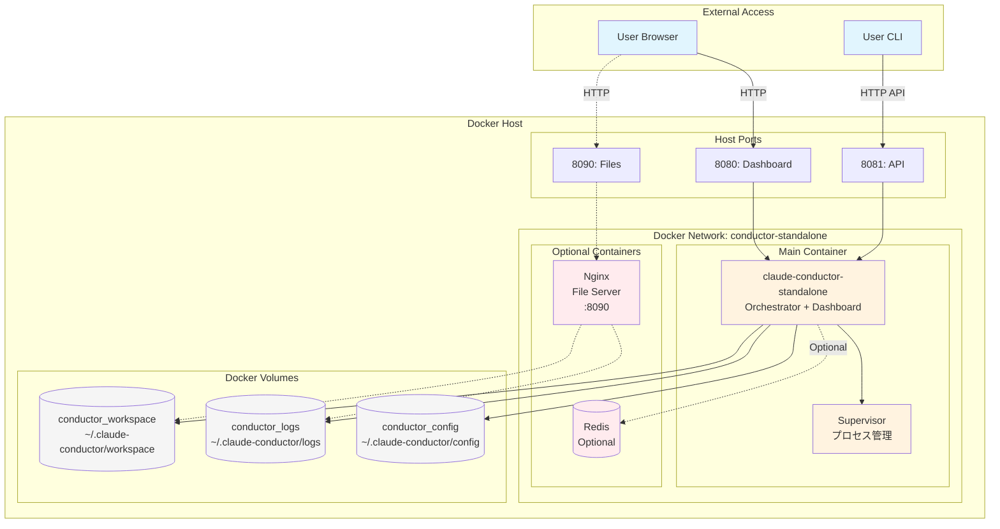
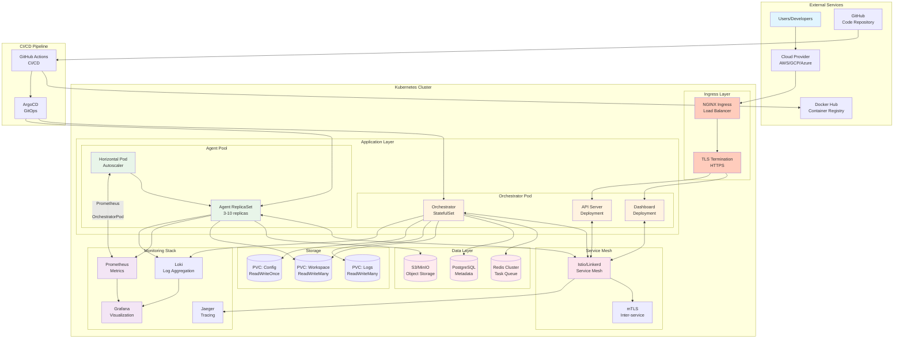
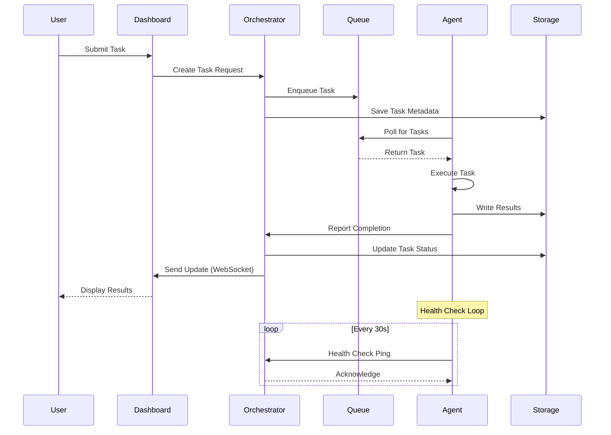
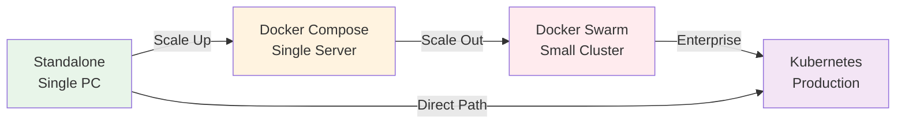

# Claude Conductor - Architecture Diagrams

## Standalone Subset Architecture (単一PC版)

### Standalone版の特徴:
- **シンプルな構成**: 単一マシンで完結
- **軽量リソース**: メモリ2GB、CPU 0.5-2コア
- **ローカルストレージ**: ファイルベースの永続化
- **インメモリキュー**: Redisなしでの動作
- **Mockモード**: Claude Code CLIのモック実装

---

## Docker Compose Standalone Architecture

---

## Full Production Architecture (フルセット版)

### フルセット版の特徴:
- **高可用性**: マルチレプリカ、自動フェイルオーバー
- **自動スケーリング**: HPA、VPA、Cluster Autoscaler
- **エンタープライズセキュリティ**: mTLS、RBAC、Network Policies
- **完全な監視**: メトリクス、ログ、トレーシング
- **GitOps**: 宣言的デプロイメント、自動同期

---

## Component Communication Flow

---

## Deployment Evolution Path

### 移行パス:
1. **Standalone → Docker Compose**: コンテナ化による安定性向上
2. **Docker Compose → Swarm**: 複数ノードへの展開
3. **Swarm → Kubernetes**: エンタープライズ機能の活用
4. **Direct to K8s**: 大規模展開の場合は直接移行